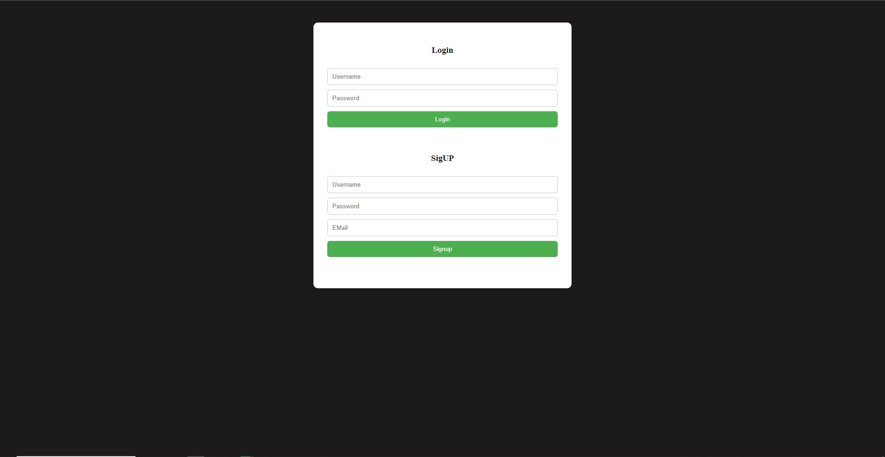

# PHP Login & Signup System 🔐

This project is a simple but functional user authentication system built with **pure PHP** and **MySQL**, showcasing backend fundamentals like session management, error handling, secure authentication logic, and a basic MVC-style folder structure.

---

## 💡 Features

- ✅ User registration (signup)
- ✅ User login with session handling
- ✅ Error validation (server-side)
- ✅ Input sanitization
- ✅ Success and error messages via session flash
- ✅ Clean code separation (controller, model, view)
- ✅ Prepared statements to prevent SQL injection

---

## 🗂️ Project Structure


```
Home-Page/
├── index.php
├── includes/
│   ├── config_session.inc.php     # Starts session safely
│   ├── dbh.inc.php                # Database connection via PDO
│   ├── login.inc.php              # Handles POST login requests
│   ├── login_contr.inc.php        # Validates login inputs
│   ├── login_model.inc.php        # Queries user data
│   ├── login_view.inc.php         # Displays login errors
│   ├── signup.inc.php             # Handles POST signup requests
│   ├── signup_contr.inc.php       # Validates signup inputs
│   ├── signup_model.inc.php       # Inserts new users
│   ├── signup_view.inc.php        # Displays signup errors
```

---

## 🛠️ Technologies Used

- PHP (Vanilla)
- MySQL (via PDO)
- HTML (basic forms)
- Apache (via XAMPP or WAMP recommended)

---
## 🔍 Preview


